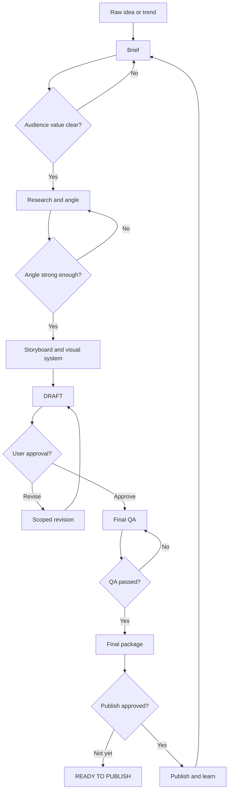

# Carousel for IG

> Turn a raw idea or emerging trend into a researched, branded and reviewable Instagram carousel.

**Research → Angle → Storyboard → Visual Direction → Review → Final Package → Performance Learning**

Built from a real F&B carousel production workflow for Phat Trinh—not from a generic social-media template.

## Workflow at a glance

The detailed map includes pass conditions, failure routes and lifecycle states: [view the full workflow flowchart](references/workflow-flowchart.md).

## What this skill does

| Stage | Result |
|---|---|
| Brief | Defines the audience, objective and learning outcome |
| Research | Verifies trends and separates facts from interpretation |
| Angle | Removes repetition and selects the strongest editorial point of view |
| Storyboard | Builds a 5–10 slide narrative with one lesson per slide |
| Visual system | Locks format, typography, palette, imagery and layout rules |
| Review | Produces a clear draft with scoped approval decisions |
| Revision | Changes only what was requested and preserves approved work |
| Final QA | Checks copy, crop, safe margins, sequence and file integrity |
| Package | Delivers ordered images, captions, alt text, sources and upload notes |
| Learning loop | Uses saves, shares, comments and reach to improve the next post |

## Cocktail editorial visual system

- Instagram portrait: **1080 × 1350 px**
- Off-white paper background
- Black serif headlines
- Large persimmon numbers
- Controlled wasabi accents
- Bright premium studio photography
- Generous negative space
- Full glass and garnish without accidental cropping

## Production guardrails

- Define what the viewer learns before designing.
- Audit recent posts before committing to an angle.
- Use research to support a point of view, not replace one.
- Keep one distinct lesson per slide.
- Do not rebuild approved slides during a scoped revision.
- Do not call a package final until every image opens successfully.
- Never auto-publish without explicit final approval.

## Real production lessons

The skill includes a case study from the **Global Cocktail Trends** carousel. It records:

- Why the first direction felt too generic.
- How audience value became an approval gate.
- How the tone moved from prediction to personal observation.
- How five trend slides were materially refined while preserving the seven-theme structure.
- How numbering, colour, crop and lighting were standardised.
- Why flattened PNGs are delivery assets—not reusable Canva automation templates.
- Why a ZIP passing an integrity test does not prove every extracted image is healthy.

## Repository structure

    .
    ├── SKILL.md
    ├── agents/
    │   └── openai.yaml
    ├── assets/
    │   └── icon.svg
    └── references/
        ├── workflow-flowchart.md
        ├── production-workflow.md
        ├── qa-checklist.md
        └── case-study-global-cocktail-trends.md

## Example prompt

> Use $carousel-for-ig to turn this idea into a researched Instagram carousel. Show me the angle, audience learning outcome and storyboard before producing final assets.

## Included references

- [Visual workflow and approval gates](references/workflow-flowchart.md)
- [Complete production workflow](references/production-workflow.md)
- [Final QA checklist](references/qa-checklist.md)
- [Global Cocktail Trends case study](references/case-study-global-cocktail-trends.md)

## Approval principle

**Draft first. Revise with scope control. Finalise only after explicit approval.**
