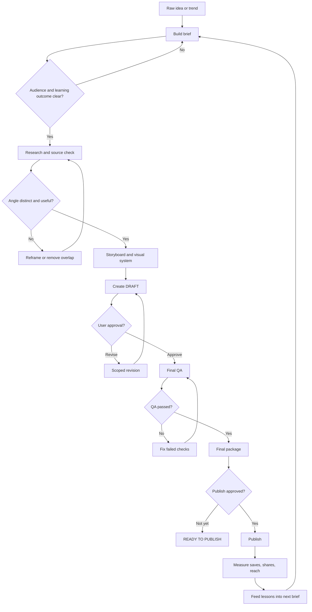

# Carousel for IG — Workflow Flowchart

This is the operating map for turning a raw idea into a publish-ready Instagram carousel. A failed decision returns only to the nearest relevant stage, so approved work stays intact.

## Approval gates

| Gate | Pass condition | If it fails |
|---|---|---|
| Brief | Audience and learning outcome are explicit | Clarify the brief |
| Angle | Distinct, useful, sourceable and visually viable | Reframe or remove overlap |
| Draft | User approves the concept, narrative and requested visuals | Revise only the requested scope |
| QA | Copy, crop, sequence, dimensions and files pass inspection | Fix failed checks and re-run QA |
| Publish | User explicitly approves publishing | Hold as READY TO PUBLISH |

## State labels

Use one unambiguous status at a time:

`NEW → RESEARCHING → STRATEGY_READY → DRAFT_READY → REVISION or APPROVED → READY_TO_PUBLISH → PUBLISHED`
